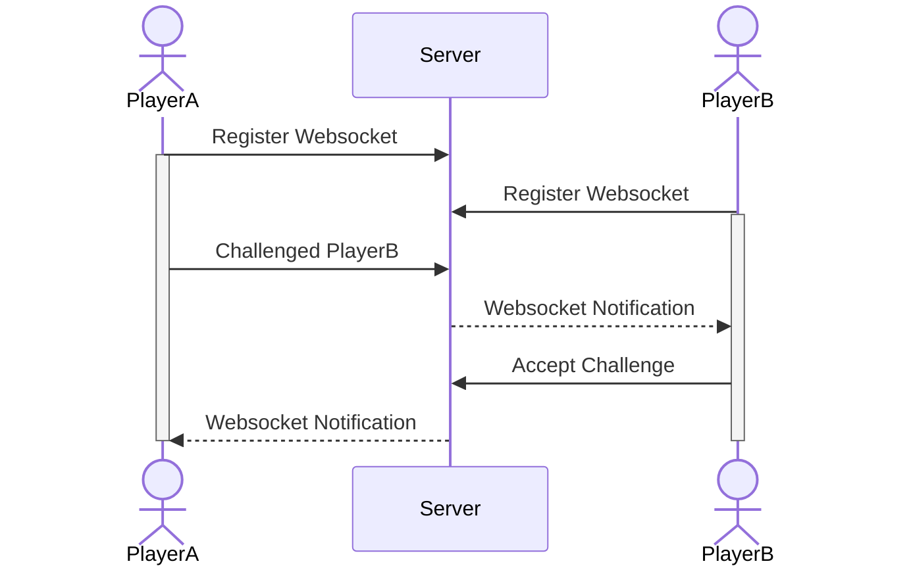
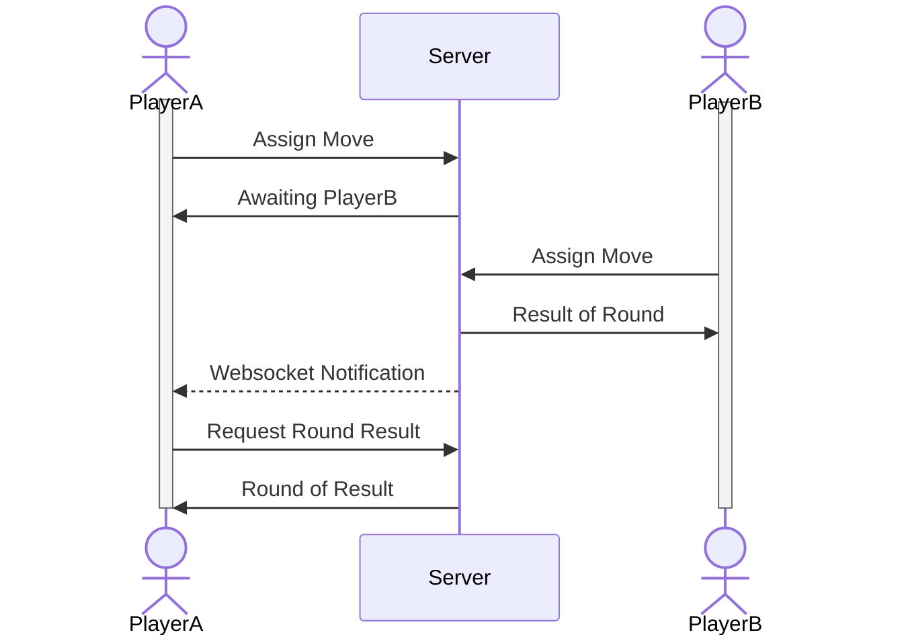

## Duel Intialization

```mermaid
sequenceDiagram
	actor PlayerA
	PlayerA->>Server: Register Websocket
	activate PlayerA
	actor PlayerB
	PlayerB->>Server: Register Websocket
	activate PlayerB
	PlayerA->>Server: Challenged PlayerB
	Server-->>PlayerB: Websocket Notification
	PlayerB->>Server: Accept Challenge
	Server-->>PlayerA: Websocket Notification
	deactivate PlayerB
	deactivate PlayerA
```

## Move Initialization

```mermaid
sequenceDiagram
	actor PlayerA
	activate PlayerA
	activate PlayerB
	PlayerA->>Server: Assign Move
	Server->>PlayerA: Awaiting PlayerB
	actor PlayerB
	PlayerB->>Server: Assign Move
	Server->>PlayerB: Result of Round
	Server-->>PlayerA: Websocket Notification
	PlayerA->>Server: Request Round Result
	Server->>PlayerA: Round of Result
	deactivate PlayerB
	deactivate PlayerA
```